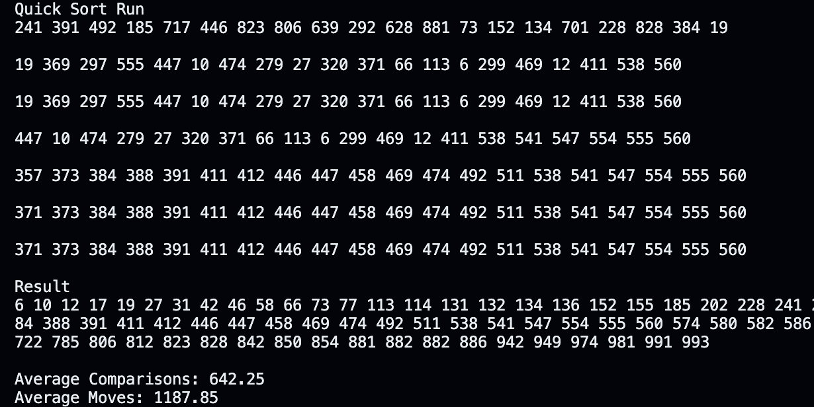
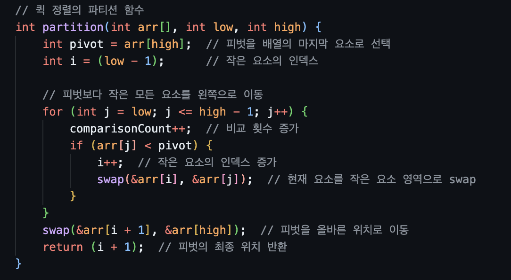
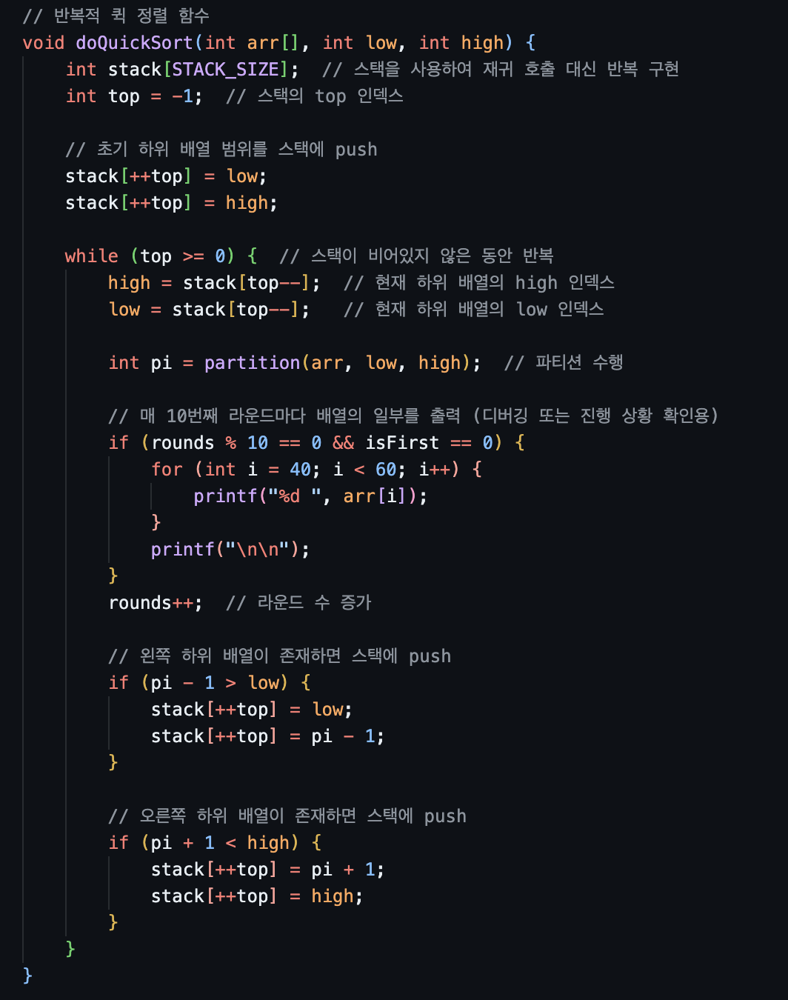

## [result]

## [code]
<table width="100%">
  <tr>
    <td align="left" width="50%">
      
    </td>
    <td align="center" width="50%">
      
    </td>
  </tr>
</table>

## [sorting]

| 정렬 알고리즘 | 평균       | 최악       | 최선     | 제자리 정렬 | 안정성 |
|---------------|------------|------------|----------|-------------|--------|
| 퀵 정렬       | O(nlogn)   | O(n^2)     | O(nlogn) | 가능        | 불안정 |
| 병합 정렬     | O(nlogn)   | O(nlogn)   | O(nlogn) | 불가능      | 안정   |
| 힙 정렬       | O(nlogn)   | O(nlogn)   | O(nlogn) | 가능        | 불안정 |
| 삽입 정렬     | O(n^2)     | O(n^2)     | O(n)     | 가능        | 안정   |
| 선택 정렬     | O(n^2)     | O(n^2)     | O(n^2)   | 가능        | 불안정 |
| 버블 정렬     | O(n^2)     | O(n^2)     | O(n^2)     | 가능        | 안정   |
| 쉘 정렬     | O(n^3/2)     | O(n^3/2)     | O(n)     | 가능        | 불안정   |