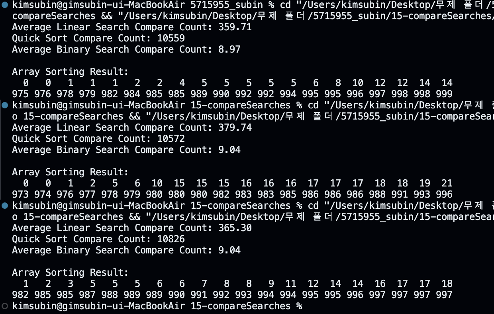
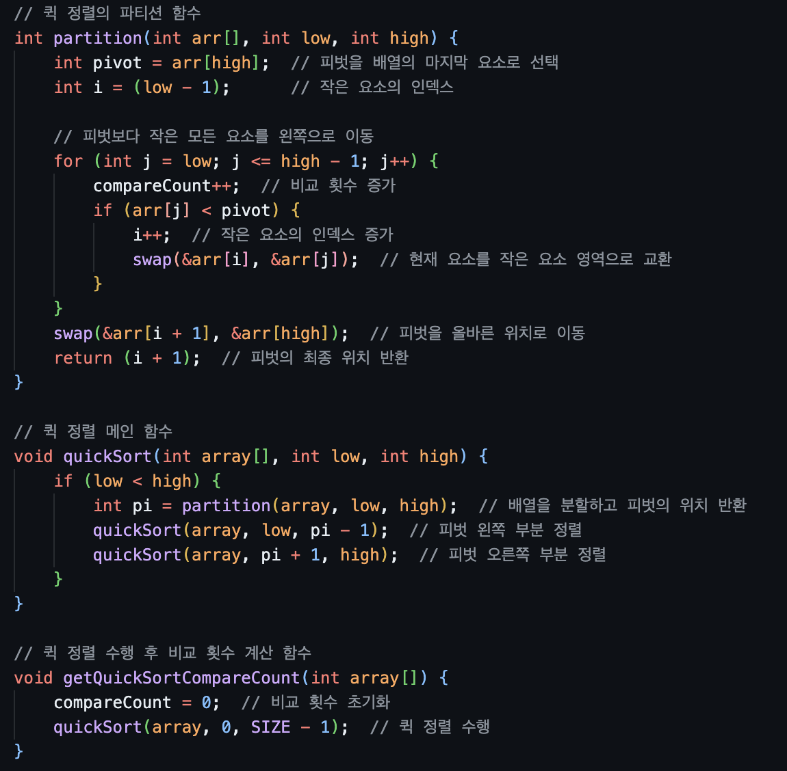
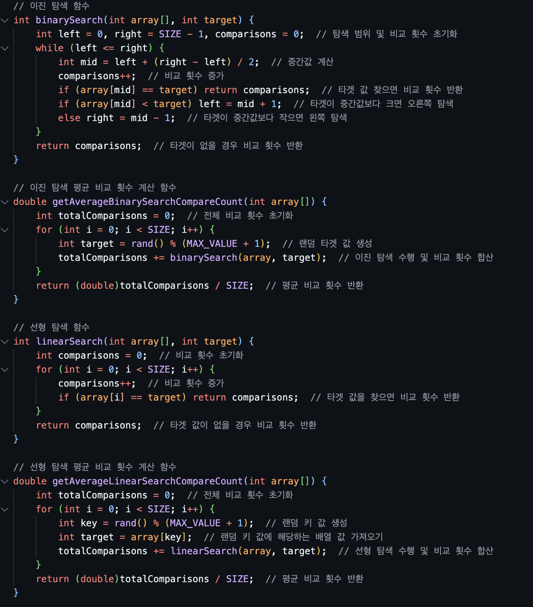

## [result]

## [code]
<table width="100%">
  <tr>
    <td align="left" width="50%">
      
    </td>
    <td align="center" width="50%">
      
    </td>
  </tr>
</table>

## [reason]
# 시간 복잡도 차이
**퀵 정렬 (Quick Sort)**
- 평균 시간 복잡도: O(n log n)
- 최악의 경우 시간 복잡도: O(n²)
- 정렬 과정에서 많은 비교가 이루어지지만, 한 번만 수행됨

**순차 탐색 (Linear Search)**
순차 탐색의 시간 복잡도는 O(n)입니다. 여기서 n은 배열의 크기를 나타냅니다. 이는 최악의 경우 배열의 모든 요소를 검사해야 할 수 있음을 의미합니다.
-   평균적으로 n/2번의 비교가 필요합니다.
- 	배열이 정렬되어 있는지 여부와 관계없이 동작합니다.

**이진 탐색 (Binary Search)**
이진 탐색의 시간 복잡도는 O(log n)입니다. 이는 각 단계마다 검색 범위를 절반으로 줄이기 때문입니다.
-   정렬된 배열에서만 사용 가능합니다.
-	최악의 경우에도 log₂(n) + 1번의 비교만 필요합니다.
# 실제 비교 횟수
주어진 코드에서 SIZE가 1000이므로:
-	순차 탐색: 평균적으로 500번의 비교가 필요합니다.
-	이진 탐색: 최악의 경우에도 log₂(1000) + 1 ≈ 10번의 비교만 필요합니다.
# 퀵 정렬의 영향
퀵 정렬은 평균 시간 복잡도가 O(n log n)인 효율적인 정렬 알고리즘입니다. 이진 탐색을 위해 배열을 정렬하는 데 추가적인 비교가 필요하지만, 이는 한 번만 수행됩니다.
-	정렬 후에는 이진 탐색의 효율성이 크게 향상됩니다.
-	여러 번의 검색 작업을 수행할 경우, 초기 정렬 비용을 상쇄하고도 남습니다.
# 결론
이진 탐색은 로그 시간 복잡도로 인해 큰 데이터셋에서 순차 탐색보다 훨씬 효율적입니다. 퀵 정렬의 추가 비용에도 불구하고, 반복적인 검색 작업에서는 이진 탐색이 순차 탐색보다 월등히 우수한 성능을 보입니다.
이러한 이유로, 퀵 정렬 후 이진 탐색이 순차 탐색보다 적은 비교 횟수를 나타내는 것입니다.