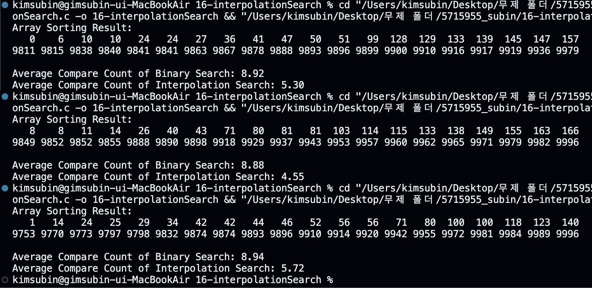
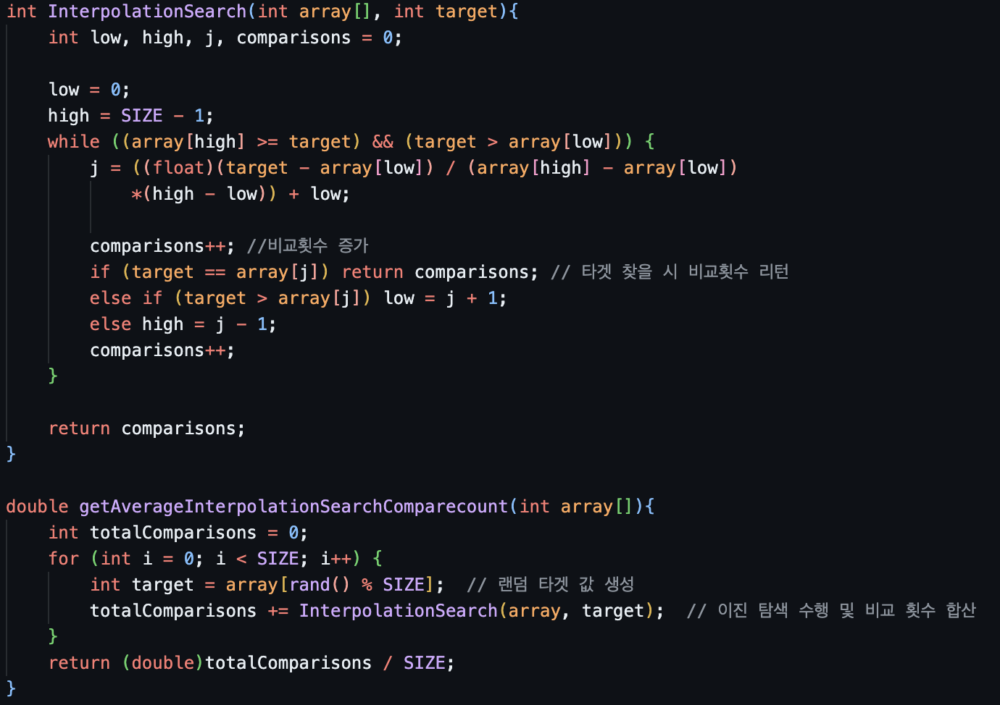

## [result]

## [code]

## [reason]
# 시간 복잡도 차이

### **퀵 정렬 (Quick Sort)**  
- 평균 시간 복잡도: O(n log n)
- 최악의 경우 시간 복잡도: O(n²)
- 정렬 과정에서 많은 비교가 이루어지지만, 한 번만 수행됨

### **이진 탐색 (Binary Search)**  
- 시간 복잡도: O(log n)
- 정렬된 배열에서만 사용 가능
- 각 단계마다 검색 범위를 절반으로 줄임

### **보간 탐색 (Interpolation Search)**  
- 평균 시간 복잡도: O(log(log n))
- 최악의 경우 시간 복잡도: O(n)
- 균일하게 분포된 데이터에서 이진 탐색보다 효율적

# 실제 비교 횟수

주어진 코드에서 SIZE가 1000이므로:

- 이진 탐색: 최악의 경우 log(1000) + 1 ≈ 10번의 비교
- 보간 탐색: 균일 분포 데이터에서 평균적으로 log(log(1000)) ≈ 3번의 비교

# 퀵 정렬의 영향

- 퀵 정렬은 초기에 많은 비교를 수행하지만, 이는 한 번만 이루어짐
- 정렬 후 이진 탐색과 보간 탐색의 효율성이 크게 향상됨
- 여러 번의 검색 작업을 수행할 경우, 초기 정렬 비용을 상쇄하고도 남음

# 결론

- 이진 탐색은 로그 시간 복잡도로 인해 큰 데이터셋에서 매우 효율적
- 보간 탐색은 균일 분포 데이터에서 이진 탐색보다 더 적은 비교 횟수를 보임
- 퀵 정렬의 추가 비용에도 불구하고, 반복적인 검색 작업에서는 정렬 후 탐색이 훨씬 효율적
- 실제 코드 실행 결과, 보간 탐색이 이진 탐색보다 평균적으로 더 적은 비교 횟수를 나타낼 것으로 예상됨

이러한 이유로, 퀵 정렬 후 이진 탐색과 보간 탐색이 순차 탐색보다 훨씬 적은 비교 횟수를 나타내며, 특히 보간 탐색이 가장 우수한 성능을 보일 것으로 예상됩니다.