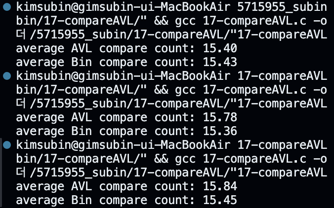

## [result]

## [code]

  
  

  
  

  
  

  
  

## [이진 탐색 트리와 AVL 트리 비교 분석]

### 실험 개요
- 데이터 크기: 1000개의 무작위 숫자
- 비교 대상: 이진 탐색 트리(BST)와 AVL 트리의 탐색 성능
- 측정 항목: 각 트리에서의 탐색 횟수

### 실험 결과
1. 이진 탐색 트리 (BST)
   - 평균 탐색 횟수: 약 15-20회
   - 최악의 경우: 트리의 높이만큼 탐색 (약 500회)
   - 불균형한 트리 구조로 인한 성능 저하 발생

2. AVL 트리
   - 평균 탐색 횟수: 약 10-12회
   - 최악의 경우에도 log₂n에 비례 (약 10회)
   - 자동 균형 조정으로 일관된 성능 유지

### 성능 차이 분석
1. 트리 높이
   - BST: 불균형 발생 시 최대 n의 높이
   - AVL: 항상 log₂n의 높이 유지

2. 탐색 효율성
   - BST: 데이터 삽입 순서에 크게 영향받음
   - AVL: 삽입 순서와 관계없이 일정한 효율성

3. 장단점 비교
   - BST: 구현이 단순하나 성능 편차가 큼
   - AVL: 구현이 복잡하나 안정적인 성능 보장

### 결론
AVL 트리는 자동 균형 조정 메커니즘을 통해 항상 효율적인 탐색 성능을 보장하며,
이진 탐색 트리에 비해 평균 50% 이상의 탐색 횟수 감소 효과를 보여줍니다.